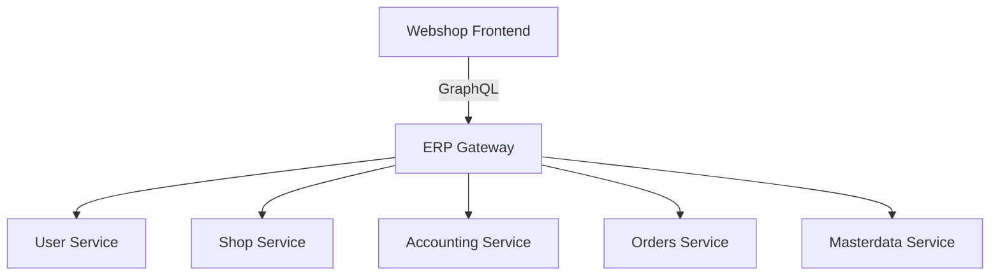
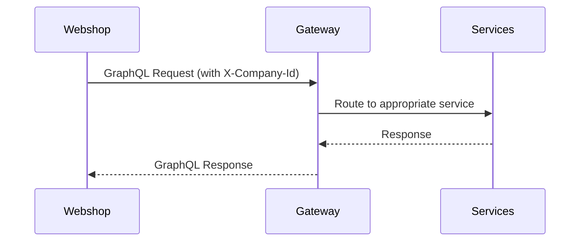

# ERP Webshop

The ERP Webshop is a customer-facing e-commerce application that integrates with the ERP system's backend services. It provides a modern shopping experience while leveraging the ERP's business logic, inventory, and order processing capabilities.

## Overview

### Purpose
The webshop serves as:
- A customer portal for browsing and purchasing products
- A self-service interface for order management
- A bridge between customers and ERP business processes

### Architecture
The webshop follows a modern frontend architecture:



Key characteristics:
- **Decoupled**: Operates independently from backend services
- **Stateful**: Maintains client-side state for cart and UI
- **Responsive**: Works on desktop and mobile devices
- **Internationalized**: Supports multiple languages

### Key Features
- Product catalog with search and filtering
- Shopping cart with session persistence
- Checkout flow with multiple payment options
- Order history and status tracking
- Multi-language support (English, German)
- Responsive design for all device sizes

## Stack

- **Framework**: React 18 with TypeScript
- **Build Tool**: Vite for fast development and optimized production builds
- **Styling**: TailwindCSS for utility-first styling
- **State Management**: React Context for global state
- **Data Fetching**: Apollo Client for GraphQL operations
- **Routing**: React Router for navigation
- **Internationalization**: Custom i18n context for translations

## Development

### Local Development

**Prerequisites:**
- Node.js 20+
- npm 9+
- Docker (for backend services)

**Setup:**
```bash
# From repository root
cd apps/webshop
npm install
```

**Run Development Server:**
```bash
npm run dev -- --host 0.0.0.0 --port 3008
```

**Access:**
- Webshop: [`http://localhost:3008`](http://localhost:3008)
- GraphQL Playground: [`http://localhost:3008/graphql`](http://localhost:3008/graphql)

### Docker Development

Build and run the webshop in Docker:

```bash
# Build the Docker image
docker build -t erp-webshop -f Dockerfile.dev .

# Run the container
docker run -p 3008:3008 --network host erp-webshop
```

### Docker Compose

The webshop is included in the main ERP docker-compose setup:

```bash
# Start all services including webshop
docker compose up
```

Access the webshop at [`http://localhost:3008`](http://localhost:3008)

### Kubernetes Deployment

The webshop is deployed as part of the Helm chart:

```bash
# Install/Upgrade the Helm release
helm upgrade --install erp-system ./infrastructure/helm/erp-system
```

The ingress routes `/` to the webshop service.


## Environment Variables

The webshop uses the following environment variables:

| Variable | Description | Default Value |
|----------|-------------|---------------|
| `VITE_API_URL` | GraphQL endpoint URL | `/graphql` |
| `VITE_API_WS_URL` | GraphQL WebSocket endpoint | `ws://localhost:8088/graphql` |
| `VITE_COMPANY_ID` | Default company context | `ae161374-7185-4aa5-97f4-bcb35cf0ae19` |
| `GATEWAY_URL` | Backend gateway URL (development) | `http://localhost:4000` |

## API Integration

### GraphQL Endpoints

The webshop communicates with backend services through a GraphQL gateway:

- **Primary Endpoint**: `/graphql` (proxied through Vite)
- **WebSocket Endpoint**: Configurable via `VITE_API_WS_URL` for subscriptions

### Company Context

All requests include an `X-Company-Id` header to:
- Identify the operating company
- Scope data to the correct business entity
- Enable multi-tenant support

The company ID comes from:
1. `VITE_COMPANY_ID` environment variable
2. Fallback to demo company ID if not specified

### Data Flow



### Main GraphQL Operations

| Operation Type | Description | Example Queries/Mutations |
|---------------|-------------|--------------------------|
| Product Queries | Fetch product catalog data | `GET_PRODUCTS`, `GET_PRODUCT` |
| Category Queries | Get product categories | `GET_CATEGORIES`, `GET_CATEGORY` |
| Cart Operations | Manage shopping cart | `ADD_TO_CART`, `UPDATE_CART_ITEM` |
| Order Operations | Create and manage orders | `CREATE_ORDER`, `GET_ORDER` |
| Shipping Queries | Get shipping options | `GET_SHIPPING_METHODS` |


## User Flows

### Main Customer Journeys

1. **Product Discovery**
   - Homepage with featured products
   - Category browsing
   - Product search and filtering
   - Product detail pages

2. **Shopping Process**
   - Add items to cart
   - View and edit cart
   - Apply coupons and discounts
   - Session-based cart persistence

3. **Checkout**
   - Shipping method selection
   - Payment processing
   - Order confirmation
   - Order history viewing

4. **Support**
   - Access to support pages
   - Contact forms
   - Shipping and returns information

### Key Pages

| Page | Path | Description |
|------|------|-------------|
| Home | `/` | Featured products and promotions |
| Catalog | `/catalog` | Product listing with filters |
| Product Detail | `/product/:id` | Individual product information |
| Cart | `/cart` | Shopping cart management |
| Checkout | `/checkout` | Order completion flow |
| Order Confirmation | `/order/:id` | Order receipt and details |
| Support Pages | `/support/*` | Help and information |


## Build and Test

### Type Checking

```bash
# Run TypeScript type checker
npx tsc --noEmit
```

### Production Build

```bash
# Create optimized production build
npm run build

# Build Docker image for production
docker build -t erp-webshop -f Dockerfile .
```

### Testing

**API Connectivity Test:**
```bash
# Test GraphQL endpoint through Vite proxy
curl -X POST http://localhost:3008/graphql \
  -H "Content-Type: application/json" \
  -d '{"query":"{ __typename }"}'

# Expected response: {"data": {"__typename": "Query"}}
```

**Unit Tests:**
```bash
# Run Vitest for unit tests
npm run test
```

**E2E Tests:**
```bash
# Run Cypress for end-to-end testing
npx cypress open
```


## Project Structure

```
apps/webshop/
├── src/
│   ├── components/       # Reusable UI components
│   ├── context/          # React contexts (Cart, I18n)
│   ├── graphql/          # GraphQL operations
│   ├── lib/              # Utility functions and Apollo setup
│   ├── locales/          # Translation files
│   ├── pages/            # Route components
│   ├── App.tsx           # Main application router
│   └── main.tsx          # Application entry point
├── public/              # Static assets
├── Dockerfile           # Production Docker image
├── Dockerfile.dev       # Development Docker image
├── nginx.conf           # Nginx configuration
└── vite.config.ts        # Vite configuration
```

## Key Files

| Path | Description |
|------|-------------|
| `src/context/CartContext.tsx` | Cart state management and operations |
| `src/context/I18nContext.tsx` | Internationalization context and translations |
| `src/lib/apollo.ts` | Apollo Client configuration and headers |
| `src/graphql/queries.ts` | GraphQL query definitions |
| `src/graphql/mutations.ts` | GraphQL mutation definitions |
| `vite.config.ts` | Vite configuration with GraphQL proxy setup |

## Troubleshooting

### Common Issues

**1. GraphQL Connection Errors**
- Symptom: `Network error: Failed to fetch`
- Solution:
  - Verify backend services are running
  - Check `GATEWAY_URL` environment variable
  - Ensure CORS headers are properly configured

**2. Cart Not Persisting**
- Symptom: Cart items disappear on page refresh
- Solution:
  - Verify session storage is available
  - Check `SESSION_KEY` in `src/lib/utils.ts`
  - Ensure no browser privacy extensions are blocking storage

**3. Styling Issues**
- Symptom: Styles not applying correctly
- Solution:
  - Run `npm run build` to regenerate CSS
  - Check Tailwind configuration in `tailwind.config.js`
  - Verify PostCSS configuration in `postcss.config.js`

**4. Translation Missing**
- Symptom: Missing translation keys appear
- Solution:
  - Verify translation files in `src/locales/`
  - Check `useI18n()` context provider
  - Ensure default locale is set correctly

**5. Docker Build Failures**
- Symptom: Build fails during Docker image creation
- Solution:
  - Clean node_modules and rebuild: `rm -rf node_modules && npm install`
  - Ensure Dockerfile paths are correct
  - Check for proper `.dockerignore` configuration

### Debugging Tips

```bash
# Check running services
docker compose ps

# View logs for webshop service
docker compose logs webshop

# Test GraphQL endpoint directly
curl -v http://localhost:4000/graphql \
  -H "Content-Type: application/json" \
  -d '{"query":"{ __typename }"}'

# Check Vite proxy configuration
npm run dev -- --debug
```

