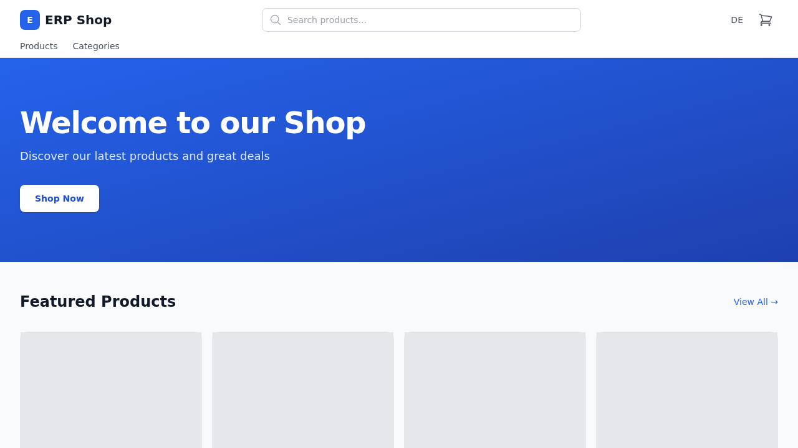
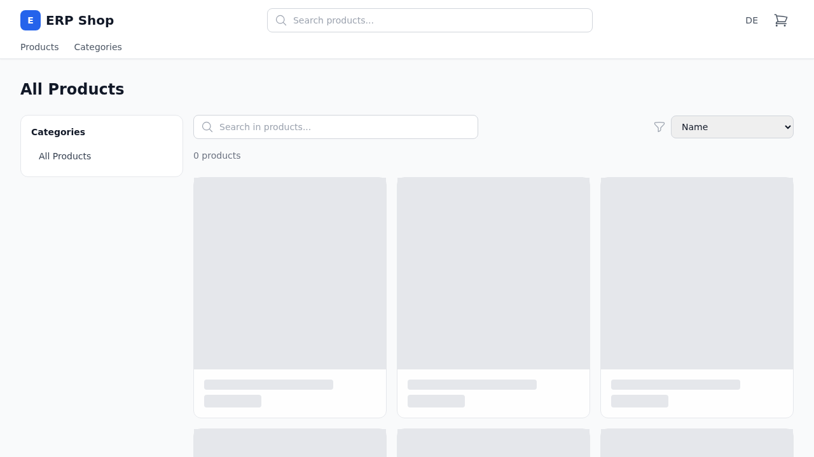
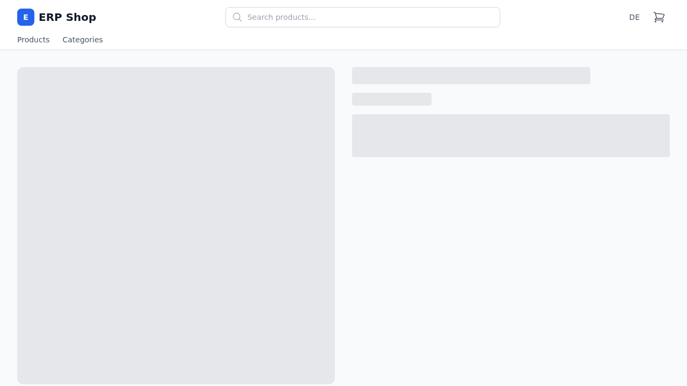
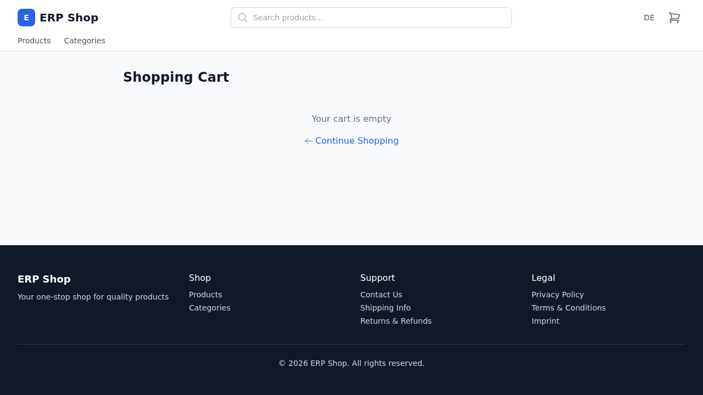
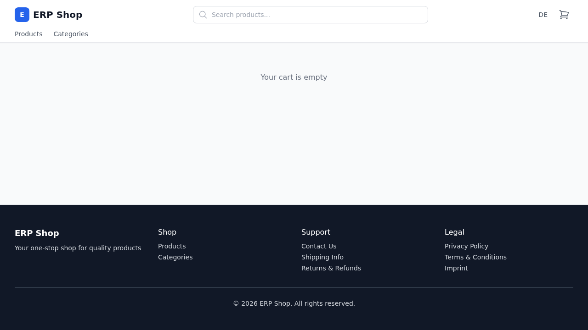

= Webshop User Guide
:toc:
:toclevels: 2
:icons: font

This guide explains the customer storefront (webshop) and the standard shopping flow.

== Access

* Open the webshop at `http://localhost:5174`.
* No ERP admin login is required for guest shopping.
* The cart is session-based and kept in your current browser session.

== Home Page

The home page contains:

* Hero section with quick navigation to products
* Category tiles for direct category browsing
* Featured products section with add-to-cart buttons

From the header you can open the cart at any time.

== Browse Products

Open `Products` or use category links from the home page.

On the catalog page you can:

* Search products by name
* Sort by name or price
* Filter by category
* Open a product detail page
* Add products to cart directly

== Product Detail

The product detail page shows full product information.

You can:

* View product description and pricing
* Adjust quantity with plus/minus controls
* Add the selected quantity to your cart

== Cart

The cart shows all selected items and current totals.

Available actions:

* Increase or decrease item quantity
* Remove items
* Clear the full cart
* Apply a coupon code
* Continue to checkout

== Checkout

At checkout, enter shipping and contact details and select a shipping method.

Before placing the order:

* Verify item list and totals
* Confirm shipping address fields
* Confirm shipping method and costs

After submission, you are redirected to the order confirmation page.

== Tips

* Keep the same browser tab/session while shopping to keep the cart state.
* If totals or item counts look outdated, refresh the page once.
* If products are missing, check the selected category and search term first.
